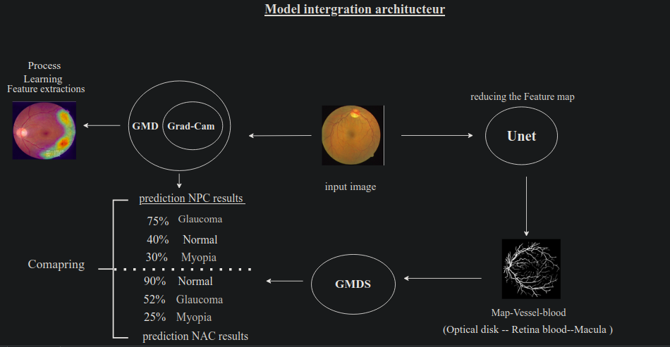

# End-to-End-integration-Model
this project was collboration with **The national university of water and Environmental Engineering** to develop the web application to diagnosis Eyes diseaes Retina Pathway , and it was Phd Philosophy under title ***Development Deep Neural Network for diagnostics Eyes diseaes***
1. Description Project:
   - we worked on End-to-End integration Models that contain tWo models **Classification** and **Segementation** each one of it built using different technologies , but important step in any Machine Learning Process is Deployment Model into production , we developed a **Web Application** using Flask to creat two EndPoints REST APIs . 

##### Part 1 building models:
as follows we built two models classifcation and segmentation and each one asychronized way. 

* **Classification** :
    - problem description :
      at this stage we explored different models architecture in computer vision , and we used Convolution neural network with adding improvement to it 
      1. collecting data :
         we obtained the data from [**Kaggle**](https://www.kaggle.com/competitions/diabetic-retinopathy-detection/data) and the team Lab Labeled it manually with expeter and it has Four Classes (DiabeticRetinopathy , Glaucoma , Myopia , Normal)
      2. Processing :
         the data was nosiy and we used Per-Processing technique to enhance data such 
         super Resolution (Autoencoder) , Oversampling (DCGAN) , Histogram Equilazation 
      3. built model :
         we explored different models architecture such RESNET and MobileNEt from Tensoflow **Per-Trained** models and we funed tune the parameters we reach out wiht out final model to ***96.58% AUC*** and it was based CNN and Smoothing is technic Regulazition to vectorize labels , and all the training process was implemented on Colab Google Platfrom that Provide GPU
* **Segmentation** :
    1. Problem Description:
      after we built the Classifier and test on different sample some problems we faced are :
        - similar features between Classes which make the model not able to predict each class good , 
        - **Map vessel blood** of eyes have low pixles range and hard to make model focus on **the region of interest**. in this stage we used ***UNET MODEL***  to Re-Create a new database which only have the Map Vessel Boold , 
    2. collecing data:
       the main goal of this model is re-creating segemented image from Funds image to reduce the high value pixle of unsued region and only keep map Vessel Boold of the eye [**the Dataset**](https://drive.grand-challenge.org/) 
    3. Built model :
       we used UNET model architecture since widly used in Biomedical Image segmentation is based on Encoder-Decoder interfaces implemented using Pytorch Framework . 
* **Grad-CAM** : 
    to make sure the model classification is performed in the right order we applied Grad-CAM activation class map to show the most area the model learn from 
    here the Full Backend Process **End-to-End integration**
    

  
     

##### Part 2 deployment MLOps:
next part was deploy the model into production to make easy to use , we developed web application using **Flask** to create two EndPoints APIS  work ascychronously which means goes from segmentation task into classification.the application has two interfaces to upload images 
1. ***First interface*** : 
      take the image and pass it into the segementer to obtain the map vessel boold and use the classifier to output the probabilit outcome of diseaes . 
2. ***Second interface*** :  
      only has the Classifier whihout need to segmente the image   

* the interfaces are the Endpoints RESt APIs : 
 

  
     
        
      

